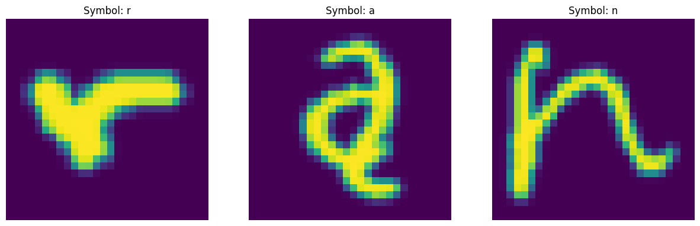
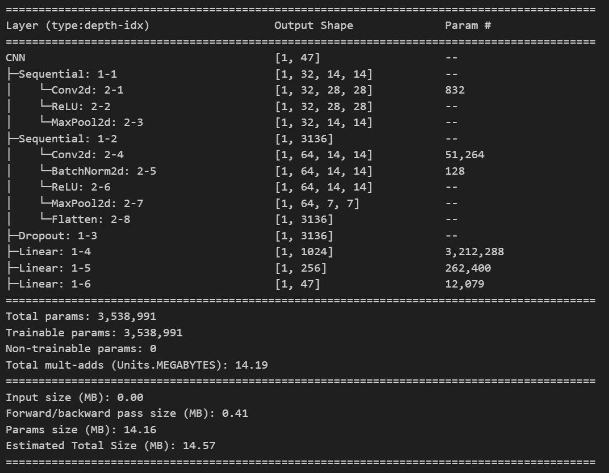

# Распознавание рукописных символов EMNIST

## 1. Описание решения
- *Тип задачи:* 

_Задача многоклассовой классификации на датасете рукописных символов EMNIST._

- *Описание данных:*

_Данные для обучения включают тренировочную и тестовую выборки, содержащие 112 800 и 18 800 изображений рукописных символов размером 28х28 пикселей в формате массивов. В каждом наборе данных метки представлены числами от 0 до 46, где каждой метке соответствует ASCII-код определенного символа._

_Соответствие «метка — код символа» указано в файле emnist-balanced-mapping.txt._

Пример данных:


- *Модель:*

*Сверточная нейронная сеть, реализованная в PyTorch* 

Архитектура:



- *Метрики на тестовых данных:*
accuracy score: 0.8875


## 2. Установка и запуск сервиса
Запуск в Docker:
1. Скопируйте web URL репозитория и откройте терминал Bash.
2. В териминале выполните следующие команды:
```bash
git clone https://github.com/MawneIl/CNN_PyTorch_EMNIST.git
cd CNN_PyTorch_EMNIST
docker build -t myapp:cnn
docker run -p 8000:8000 myapp
```

Локальный запуск:
1. Откройте терминал и перейдите корневую папку репозитория.
2. Установите необходимые библиотеки, выполнив команду:
'''bash
pip install --no-cache-dir -q -r requirements.txt
'''
3. Запустите приложение:
'''bash
uvicorn myapp.main:app
'''

Использование сервиса:
1. После выполнения комманд, в окне терминала будет показан адрес сервиса, по умолчанию http://127.0.0.1:8000/, перейдите по нему скопировав в удобный Вам браузер.
2. Нарисуйте цифру от 0 до 9 или символ от A до T.
3. Для получения предсказания нажмите кнопку "Предсказать".
4. Перед повторным использованием нажмите кнопку "Очистить".